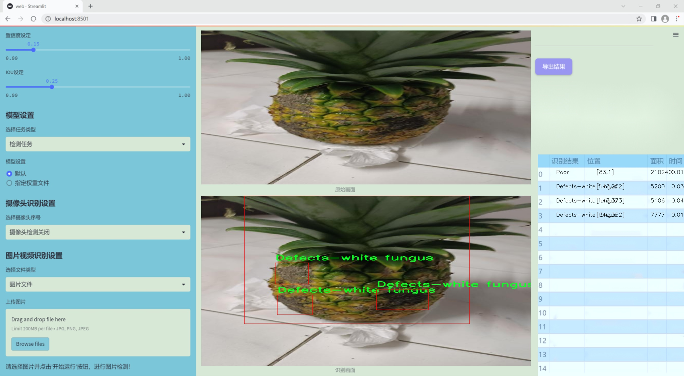
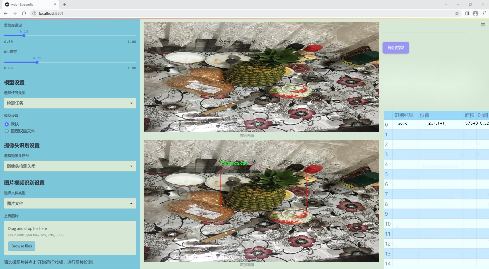
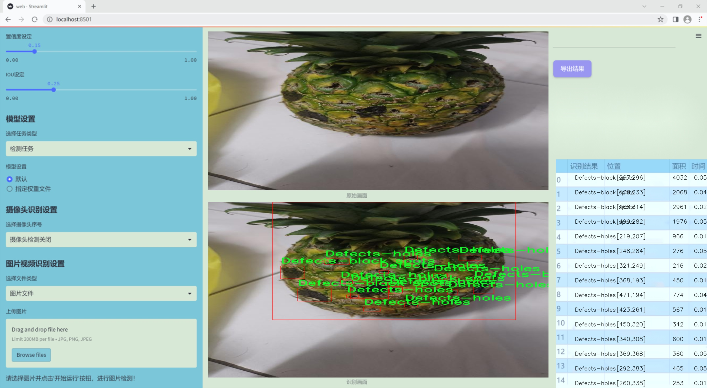
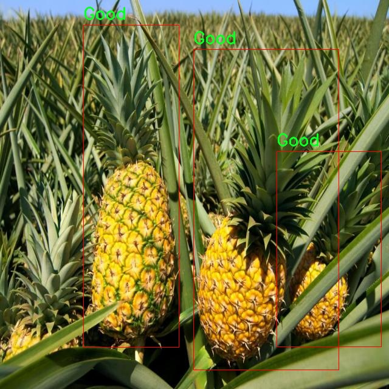
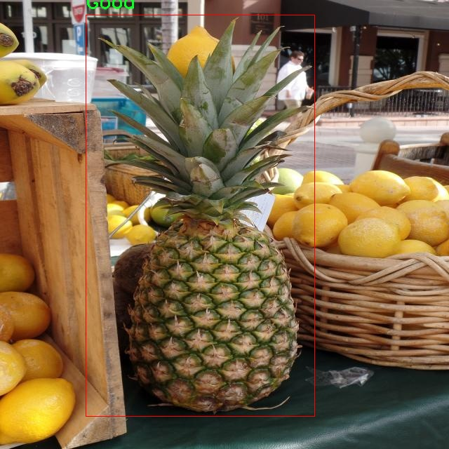
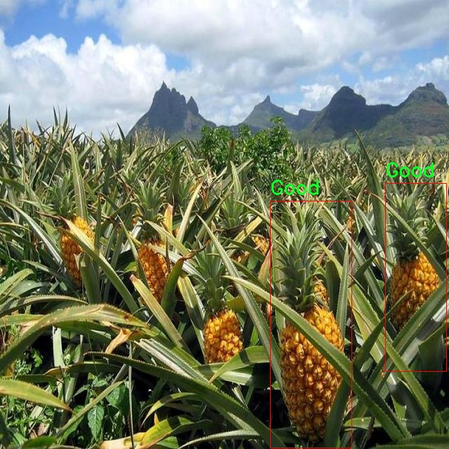
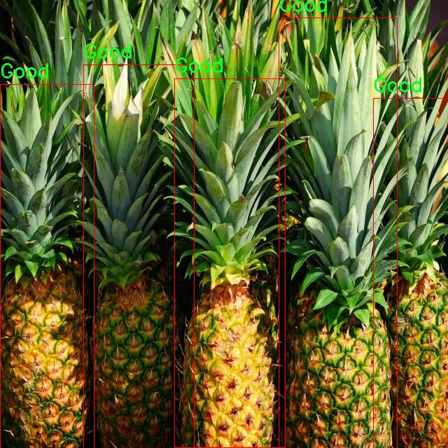
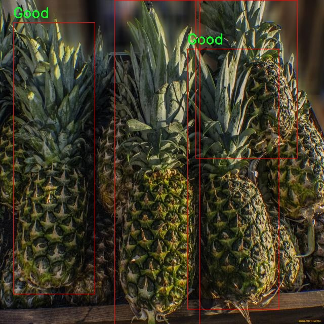

### 1.背景意义

研究背景与意义

随着全球经济的发展和人们生活水平的提高，水果的消费需求不断增加，尤其是热带水果如菠萝，因其独特的口感和丰富的营养价值而受到广泛欢迎。然而，菠萝的质量检测一直是农业生产和市场流通中的一项重要任务。传统的人工检测方法不仅耗时耗力，而且容易受到主观因素的影响，导致检测结果的不一致性。因此，利用计算机视觉技术进行菠萝质量检测，成为提升检测效率和准确性的有效途径。

近年来，深度学习技术的迅猛发展为计算机视觉领域带来了新的机遇。YOLO（You Only Look Once）系列模型因其高效的实时目标检测能力而受到广泛关注。YOLOv11作为该系列的最新版本，结合了更先进的网络结构和算法优化，能够在复杂环境中实现更高的检测精度和速度。本研究旨在基于改进的YOLOv11模型，构建一个菠萝质量检测系统，以实现对菠萝的自动化检测和分类。

本项目使用的数据集包含771张经过精心标注的菠萝图像，涵盖了五个类别：黑斑缺陷、孔洞缺陷、白色真菌缺陷、优质和劣质。这些类别的划分不仅有助于识别菠萝的外观缺陷，还能为果农和商家提供重要的质量控制依据。通过对数据集的深度学习训练，模型将能够有效识别和分类不同质量的菠萝，进而为菠萝的收获、运输和销售提供科学依据。

此外，随着智能农业和物联网技术的发展，基于深度学习的自动化检测系统在农业生产中的应用前景广阔。通过本研究的实施，不仅可以提升菠萝的市场竞争力，还能推动农业生产的智能化进程，为实现可持续发展目标贡献力量。因此，构建基于改进YOLOv11的菠萝质量检测系统，具有重要的理论价值和实际意义。

### 2.视频效果

[2.1 视频效果](https://www.bilibili.com/video/BV1RzSPYiEbu/)

### 3.图片效果







##### [项目涉及的源码数据来源链接](https://kdocs.cn/l/cszuIiCKVNis)**

注意：本项目提供训练的数据集和训练教程,由于版本持续更新,暂不提供权重文件（best.pt）,请按照6.训练教程进行训练后实现上图演示的效果。

### 4.数据集信息

##### 4.1 本项目数据集类别数＆类别名

nc: 5
names: ['Defects-black spots', 'Defects-holes', 'Defects-white fungus', 'Good', 'Poor']


该项目为【目标检测】数据集，请在【训练教程和Web端加载模型教程（第三步）】这一步的时候按照【目标检测】部分的教程来训练

##### 4.2 本项目数据集信息介绍

本项目数据集信息介绍

本项目旨在改进YOLOv11模型，以实现高效的菠萝质量检测系统。为此，我们构建了一个专门的数据集，主题为“Deteksi Kualitas Buah Nanas”，该数据集涵盖了菠萝的不同质量等级和缺陷类型，旨在为模型训练提供丰富的样本和多样化的特征。数据集中包含五个主要类别，分别是“Defects-black spots”（黑斑缺陷）、“Defects-holes”（孔洞缺陷）、“Defects-white fungus”（白色真菌缺陷）、“Good”（优质）和“Poor”（劣质）。这些类别的设置不仅考虑了菠萝的外观特征，还结合了实际市场需求，确保模型能够有效区分不同质量的菠萝。

在数据收集过程中，我们采用了多种采集方式，包括实地拍摄和实验室测试，确保数据的多样性和代表性。每个类别下的样本数量经过精心设计，以便模型在训练时能够充分学习到各类缺陷的特征。尤其是在缺陷类别中，我们注重捕捉不同光照和角度下的菠萝图像，以提高模型的鲁棒性和准确性。此外，数据集中的图像经过标注，确保每个样本都能清晰地反映其所属类别，便于后续的模型训练和评估。

通过对该数据集的深入分析和处理，我们期望能够提升YOLOv11在菠萝质量检测中的性能，使其在实际应用中能够快速、准确地识别菠萝的质量，从而为农业生产和市场流通提供有力支持。最终，我们希望该项目能够为菠萝产业的智能化发展贡献一份力量。











### 5.全套项目环境部署视频教程（零基础手把手教学）

[5.1 所需软件PyCharm和Anaconda安装教程（第一步）](https://www.bilibili.com/video/BV1BoC1YCEKi/?spm_id_from=333.999.0.0&vd_source=bc9aec86d164b67a7004b996143742dc)


[5.2 安装Python虚拟环境创建和依赖库安装视频教程（第二步）](https://www.bilibili.com/video/BV1ZoC1YCEBw?spm_id_from=333.788.videopod.sections&vd_source=bc9aec86d164b67a7004b996143742dc)

### 6.改进YOLOv11训练教程和Web_UI前端加载模型教程（零基础手把手教学）

[6.1 改进YOLOv11训练教程和Web_UI前端加载模型教程（第三步）](https://www.bilibili.com/video/BV1BoC1YCEhR?spm_id_from=333.788.videopod.sections&vd_source=bc9aec86d164b67a7004b996143742dc)


按照上面的训练视频教程链接加载项目提供的数据集，运行train.py即可开始训练



     Epoch   gpu_mem       box       obj       cls    labels  img_size
     1/200     20.8G   0.01576   0.01955  0.007536        22      1280: 100%|██████████| 849/849 [14:42<00:00,  1.04s/it]
               Class     Images     Labels          P          R     mAP@.5 mAP@.5:.95: 100%|██████████| 213/213 [01:14<00:00,  2.87it/s]
                 all       3395      17314      0.994      0.957      0.0957      0.0843

     Epoch   gpu_mem       box       obj       cls    labels  img_size
     2/200     20.8G   0.01578   0.01923  0.007006        22      1280: 100%|██████████| 849/849 [14:44<00:00,  1.04s/it]
               Class     Images     Labels          P          R     mAP@.5 mAP@.5:.95: 100%|██████████| 213/213 [01:12<00:00,  2.95it/s]
                 all       3395      17314      0.996      0.956      0.0957      0.0845

     Epoch   gpu_mem       box       obj       cls    labels  img_size
     3/200     20.8G   0.01561    0.0191  0.006895        27      1280: 100%|██████████| 849/849 [10:56<00:00,  1.29it/s]
               Class     Images     Labels          P          R     mAP@.5 mAP@.5:.95: 100%|███████   | 187/213 [00:52<00:00,  4.04it/s]
                 all       3395      17314      0.996      0.957      0.0957      0.0845


###### [项目数据集下载链接](https://kdocs.cn/l/cszuIiCKVNis)

### 7.原始YOLOv11算法讲解


YOLO11 是 Ultralytics YOLO 系列的最新版本，结合了尖端的准确性、速度和效率，用于目标检测、分割、分类、定向边界框和姿态估计。与
YOLOv8 相比，它具有更少的参数和更好的结果，不难预见，YOLO11 在边缘设备上更高效、更快，将频繁出现在计算机视觉领域的最先进技术（SOTA）中。


**主要特点**

  * **增强的特征提取：**YOLO11 使用改进的主干和颈部架构来增强特征提取，以实现更精确的目标检测和复杂任务的性能。

  * **针对效率和速度优化：**精细的架构设计和优化的训练流程在保持准确性和性能之间最佳平衡的同时，提供更快的处理速度。

  * **更少的参数，更高的准确度：**YOLO11m 在 COCO 数据集上实现了比 YOLOv8m 更高的 mAP，参数减少了 22%，提高了计算效率，同时不牺牲准确度。

  * **跨环境的适应性：**YOLO11 可以无缝部署在边缘设备、云平台和配备 NVIDIA GPU 的系统上，确保最大的灵活性。

  * **支持广泛的任务范围：**YOLO11 支持各种计算机视觉任务，如目标检测、实例分割、图像分类、姿态估计和定向目标检测（OBB）。


### 8.200+种全套改进YOLOV11创新点原理讲解

#### 8.1 200+种全套改进YOLOV11创新点原理讲解大全

由于篇幅限制，每个创新点的具体原理讲解就不全部展开，具体见下列网址中的改进模块对应项目的技术原理博客网址【Blog】（创新点均为模块化搭建，原理适配YOLOv5~YOLOv11等各种版本）

[改进模块技术原理博客【Blog】网址链接](https://gitee.com/qunmasj/good)


#### 8.2 精选部分改进YOLOV11创新点原理讲解

###### 这里节选部分改进创新点展开原理讲解(完整的改进原理见上图和[改进模块技术原理博客链接](https://gitee.com/qunmasj/good)【如果此小节的图加载失败可以通过CSDN或者Github搜索该博客的标题访问原始博客，原始博客图片显示正常】


### 感受野注意力卷积（RFAConv)
#### 标准卷积操作回顾
标准的卷积操作是构造卷积神经网络的基本构件。它利用具有共享参数的滑动窗口提取特征信息，克服了全连通层构造神经网络固有的参数多、计算开销大的问题。设 X R∈C×H×W
表示输入特征图，其中C、H、W分别表示特征图的通道数、高度、宽度。为了清楚地演示卷积核的特征提取过程，我们使用 C = 1 的例子。从每个接受域滑块中提取特征信息的卷积运算可以表示为:


这里，Fi 表示计算后每个卷积滑块得到的值，Xi 表示每个滑块内对应位置的像素值，K表示卷积核，S表示卷积核中的参数个数，N表示接收域滑块的总数。可以看出，每个滑块内相同位置的 feature共享相同的参数Ki。因此，标准的卷积运算并不能捕捉到不同位置所带来的信息差异，这最终在一定程度上限制了卷积神经网络的性能。 

#### 空间注意力回顾
目前，空间注意机制是利用学习得到的注意图来突出每个特征的重要性。与前一节类似，这里以 C=1为例。突出关键特征的空间注意机制可以简单表述为:这里，Fi 表示加权运算后得到的值。xi 和Ai 表示输入特征图和学习到的注意图在不同位置的值，N为输入特征图的高和宽的乘积，表示像素值的总数。


#### 空间注意与标准卷积运算
将注意力机制整合到卷积神经网络中，可以提高卷积神经网络的性能。通过对标准卷积运算和现有空间注意机制的研究，我们认为空间注意机制有效地克服了卷积神经网络固有的参数共享的局限性。目前卷积神经网络中最常用的核大小是 1 × 1和3 × 3。在引入空间注意机制后，提取特征的卷积操作可以是 1 × 1或3 × 3卷积操作。为了直观地展示这个过程，在 1 × 1卷积运算的前面插入了空间注意机制。通过注意图对输入特征图(Re-weight“×”)进行加权运算，最后通过 1 × 1卷积运算提取接收域的滑块特征信息。整个过程可以简单地表示如下:


 这里卷积核K仅代表一个参数值。如果取A i× ki 的值作为一种新的卷积核参数，有趣的是它解决了 1×1卷积运算提取特征时的参数共享问题。然而，关于空间注意机制的传说到此结束。当空间注意机制被插入到3×3卷积运算前面时。具体情况如下:


如上所述，如果取A的值 i × ki (4)式作为一种新的卷积核参数，完全解决了大规模卷积核的参数共享问题。然而，最重要的一点是，卷积核在提取每个接受域滑块的特征时，会共享一些特征。换句话说，每个接收域滑块内都有一个重叠。仔细分析后会发现A12= a21， a13 = a22， a15 = a24……，在这种情况下，每个滑动窗口共享空间注意力地图的权重。因此，空间注意机制没有考虑整个接受域的空间特征，不能有效地解决大规模卷积核的参数共享问题。因此，空间注意机制的有效性受到限制。 

#### 创新空间注意力和标准卷积操作
该博客提出解决了现有空间注意机制的局限性，为空间处理提供了一种创新的解决方案。受RFA的启发，一系列空间注意机制被开发出来，可以进一步提高卷积神经网络的性能。RFA可以看作是一个轻量级即插即用模块，RFA设计的卷积运算(RFAConv)可以代替标准卷积来提高卷积神经网络的性能。因此，我们预测空间注意机制与标准卷积运算的结合将继续发展，并在未来带来新的突破。
接受域空间特征:为了更好地理解接受域空间特征的概念，我们将提供相关的定义。接收域空间特征是专门为卷积核设计的，并根据核大小动态生成。如图1所示，以3×3卷积核为例。在图1中，“Spatial Feature”指的是原始的Feature map。“接受域空间特征”是空间特征变换后的特征图。

 

由不重叠的滑动窗口组成。当使用 3×3卷积内核提取特征时，接收域空间特征中的每个 3×3大小窗口代表一个接收域滑块。接受域注意卷积(RFAConv):针对接受域的空间特征，我们提出了接受域注意卷积(RFA)。该方法不仅强调了接收域滑块内不同特征的重要性，而且对接收域空间特征进行了优先排序。通过该方法，完全解决了卷积核参数共享的问题。接受域空间特征是根据卷积核的大小动态生成的，因此，RFA是卷积的固定组合，不能与卷积操作的帮助分离，卷积操作同时依赖于RFA来提高性能，因此我们提出了接受场注意卷积(RFAConv)。具有3×3大小的卷积核的RFAConv整体结构如图所示。


目前，最广泛使用的接受域特征提取方法是缓慢的。经过大量的研究，我们开发了一种快速的方法，用分组卷积来代替原来的方法。具体来说，我们利用相应大小的分组卷积来动态生成基于接受域大小的展开特征。尽管与原始的无参数方法(如PyTorch提供的nn.())相比，该方法增加了一些参数，但它的速度要快得多。注意:如前一节所述，当使用 3×3卷积内核提取特征时，接收域空间特征中的每个 3×3大小窗口表示一个接收域滑块。而利用快速分组卷积提取感受野特征后，将原始特征映射为新的特征。最近的研究表明。交互信息可以提高网络性能，如[40,41,42]所示。同样，对于RFAConv来说，通过交互接受域特征信息来学习注意图可以提高网络性能。然而，与每个接收域特征交互会导致额外的计算开销，因此为了最小化计算开销和参数的数量，我们使用AvgPool来聚合每个接收域特征的全局信息。然后，使用 1×1 组卷积操作进行信息交互。最后，我们使用softmax来强调每个特征在接受域特征中的重要性。一般情况下，RFA的计算可以表示为:


这里gi×i 表示一个大小为 i×i的分组卷积，k表示卷积核的大小，Norm表示归一化，X表示输入的特征图，F由注意图 a相乘得到 rf 与转换后的接受域空间特征 Frf。与CBAM和CA不同，RFA能够为每个接受域特征生成注意图。卷积神经网络的性能受到标准卷积操作的限制，因为卷积操作依赖于共享参数，对位置变化带来的信息差异不敏感。然而，RFAConv通过强调接收域滑块中不同特征的重要性，并对接收域空间特征进行优先级排序，可以完全解决这个问题。通过RFA得到的feature map是接受域空间特征，在“Adjust Shape”后没有重叠。因此，学习到的注意图将每个接受域滑块的特征信息聚合起来。换句话说，注意力地图不再共享在每个接受域滑块。这完全弥补了现有 CA和CBAM注意机制的不足。RFA为标准卷积内核提供了显著的好处。而在调整形状后，特征的高度和宽度是 k倍，需要进行 stride = k的k × k卷积运算来提取特征信息。RFA设计的卷积运算RFAConv为卷积带来了良好的增益，对标准卷积进行了创新。
此外，我们认为现有的空间注意机制应该优先考虑接受域空间特征，以提高网络性能。众所周知，基于自注意机制的网络模型[43,44,45]取得了很大的成功，因为它解决了卷积参数共享的问题，并对远程信息进行建模。然而，自注意机制也为模型引入了显著的计算开销和复杂性。我们认为，将现有的空间注意机制的注意力引导到接受场空间特征上，可以以类似于自我注意的方式解决长期信息的参数共享和建模问题。与自我关注相比，这种方法需要的参数和计算资源少得多。答案如下:(1)将以接收场空间特征为中心的空间注意机制与卷积相结合，消除了卷积参数共享的问题。(2)现有的空间注意机制已经考虑了远程信息，可以通过全局平均池或全局最大池的方式获取全局信息，其中明确考虑了远程信息。因此，我们设计了新的 CBAM和CA模型，称为RFCBAM和RFCA，它们专注于接受域空间特征。与RFA类似，使用最终的k × k stride = k 的卷积运算来提取特征信息。这两种新的卷积方法的具体结构如图 3所示，我们称这两种新的卷积操作为 RFCBAMConv和RFCAConv。与原来的CBAM相比，我们在RFCBAM中使用SE attention来代替CAM。因为这样可以减少计算开销。此外，在RFCBAM中，通道注意和空间注意不是分开执行的。相反，它们是同时加权的，使得每个通道获得的注意力地图是不同的。


### 9.系统功能展示

图9.1.系统支持检测结果表格显示

  图9.2.系统支持置信度和IOU阈值手动调节

  图9.3.系统支持自定义加载权重文件best.pt(需要你通过步骤5中训练获得)

  图9.4.系统支持摄像头实时识别

  图9.5.系统支持图片识别

  图9.6.系统支持视频识别

  图9.7.系统支持识别结果文件自动保存

  图9.8.系统支持Excel导出检测结果数据


### 10. YOLOv11核心改进源码讲解

#### 10.1 VanillaNet.py

以下是对代码的逐文件分析和核心部分的保留，并添加了详细的中文注释：

```python
import torch
import torch.nn as nn
import torch.nn.functional as F
from timm.layers import weight_init

# 定义一个激活函数类，继承自ReLU
class Activation(nn.ReLU):
    def __init__(self, dim, act_num=3, deploy=False):
        super(Activation, self).__init__()
        self.deploy = deploy  # 是否为部署模式
        # 权重初始化
        self.weight = torch.nn.Parameter(torch.randn(dim, 1, act_num*2 + 1, act_num*2 + 1))
        self.bias = None
        self.bn = nn.BatchNorm2d(dim, eps=1e-6)  # 批归一化
        self.dim = dim
        self.act_num = act_num
        weight_init.trunc_normal_(self.weight, std=.02)  # 权重截断正态初始化

    def forward(self, x):
        # 前向传播
        if self.deploy:
            return torch.nn.functional.conv2d(
                super(Activation, self).forward(x), 
                self.weight, self.bias, padding=(self.act_num*2 + 1)//2, groups=self.dim)
        else:
            return self.bn(torch.nn.functional.conv2d(
                super(Activation, self).forward(x),
                self.weight, padding=self.act_num, groups=self.dim))

    def switch_to_deploy(self):
        # 切换到部署模式，融合BN层
        if not self.deploy:
            kernel, bias = self._fuse_bn_tensor(self.weight, self.bn)
            self.weight.data = kernel
            self.bias = torch.nn.Parameter(torch.zeros(self.dim))
            self.bias.data = bias
            self.__delattr__('bn')  # 删除bn属性
            self.deploy = True

    def _fuse_bn_tensor(self, weight, bn):
        # 融合卷积层和BN层的权重
        kernel = weight
        running_mean = bn.running_mean
        running_var = bn.running_var
        gamma = bn.weight
        beta = bn.bias
        eps = bn.eps
        std = (running_var + eps).sqrt()
        t = (gamma / std).reshape(-1, 1, 1, 1)
        return kernel * t, beta + (0 - running_mean) * gamma / std

# 定义Block类，作为网络的基本构建块
class Block(nn.Module):
    def __init__(self, dim, dim_out, act_num=3, stride=2, deploy=False, ada_pool=None):
        super().__init__()
        self.deploy = deploy
        # 根据是否部署选择不同的卷积结构
        if self.deploy:
            self.conv = nn.Conv2d(dim, dim_out, kernel_size=1)
        else:
            self.conv1 = nn.Sequential(
                nn.Conv2d(dim, dim, kernel_size=1),
                nn.BatchNorm2d(dim, eps=1e-6),
            )
            self.conv2 = nn.Sequential(
                nn.Conv2d(dim, dim_out, kernel_size=1),
                nn.BatchNorm2d(dim_out, eps=1e-6)
            )

        # 池化层的选择
        self.pool = nn.Identity() if stride == 1 else nn.MaxPool2d(stride)
        self.act = Activation(dim_out, act_num)  # 激活函数

    def forward(self, x):
        # 前向传播
        if self.deploy:
            x = self.conv(x)
        else:
            x = self.conv1(x)
            x = F.leaky_relu(x, 1)  # 使用Leaky ReLU激活
            x = self.conv2(x)

        x = self.pool(x)  # 池化
        x = self.act(x)   # 激活
        return x

    def switch_to_deploy(self):
        # 切换到部署模式，融合卷积和BN层
        if not self.deploy:
            kernel, bias = self._fuse_bn_tensor(self.conv1[0], self.conv1[1])
            self.conv = self.conv2[0]
            self.conv.weight.data = kernel
            self.conv.bias.data = bias
            self.__delattr__('conv1')
            self.__delattr__('conv2')
            self.act.switch_to_deploy()
            self.deploy = True

# 定义VanillaNet类，作为主网络结构
class VanillaNet(nn.Module):
    def __init__(self, in_chans=3, num_classes=1000, dims=[96, 192, 384, 768], 
                 drop_rate=0, act_num=3, strides=[2,2,2,1], deploy=False, ada_pool=None):
        super().__init__()
        self.deploy = deploy
        # 网络的初始层
        if self.deploy:
            self.stem = nn.Sequential(
                nn.Conv2d(in_chans, dims[0], kernel_size=4, stride=4),
                Activation(dims[0], act_num)
            )
        else:
            self.stem1 = nn.Sequential(
                nn.Conv2d(in_chans, dims[0], kernel_size=4, stride=4),
                nn.BatchNorm2d(dims[0], eps=1e-6),
            )
            self.stem2 = nn.Sequential(
                nn.Conv2d(dims[0], dims[0], kernel_size=1, stride=1),
                nn.BatchNorm2d(dims[0], eps=1e-6),
                Activation(dims[0], act_num)
            )

        self.stages = nn.ModuleList()
        for i in range(len(strides)):
            stage = Block(dim=dims[i], dim_out=dims[i+1], act_num=act_num, stride=strides[i], deploy=deploy, ada_pool=ada_pool)
            self.stages.append(stage)  # 添加Block到网络中

    def forward(self, x):
        # 前向传播
        if self.deploy:
            x = self.stem(x)
        else:
            x = self.stem1(x)
            x = F.leaky_relu(x, 1)
            x = self.stem2(x)

        for stage in self.stages:
            x = stage(x)  # 通过每个Block
        return x

    def switch_to_deploy(self):
        # 切换到部署模式
        if not self.deploy:
            self.stem2[2].switch_to_deploy()
            kernel, bias = self._fuse_bn_tensor(self.stem1[0], self.stem1[1])
            self.stem1[0].weight.data = kernel
            self.stem1[0].bias.data = bias
            self.stem = nn.Sequential(self.stem1[0], self.stem2[2])
            self.__delattr__('stem1')
            self.__delattr__('stem2')

            for stage in self.stages:
                stage.switch_to_deploy()  # 切换每个Block
            self.deploy = True

# 更新模型权重的函数
def update_weight(model_dict, weight_dict):
    idx, temp_dict = 0, {}
    for k, v in weight_dict.items():
        if k in model_dict.keys() and np.shape(model_dict[k]) == np.shape(v):
            temp_dict[k] = v
            idx += 1
    model_dict.update(temp_dict)
    print(f'loading weights... {idx}/{len(model_dict)} items')
    return model_dict

# 定义不同版本的VanillaNet模型
def vanillanet_5(pretrained='', **kwargs):
    model = VanillaNet(dims=[128*4, 256*4, 512*4, 1024*4], strides=[2,2,2], **kwargs)
    if pretrained:
        weights = torch.load(pretrained)['model_ema']
        model.load_state_dict(update_weight(model.state_dict(), weights))
    return model

# 其他版本的vanillanet_6到vanillanet_13同样的结构
# ...

if __name__ == '__main__':
    inputs = torch.randn((1, 3, 640, 640))  # 输入数据
    model = vanillanet_10()  # 创建模型
    pred = model(inputs)  # 前向传播
    for i in pred:
        print(i.size())  # 输出每层的尺寸
```

### 代码核心部分分析
1. **Activation类**：实现了自定义的激活函数，并支持批归一化的融合。
2. **Block类**：定义了网络的基本构建块，包含卷积、池化和激活操作。
3. **VanillaNet类**：构建了整个网络结构，包含初始层和多个Block，支持部署模式和权重更新。
4. **update_weight函数**：用于更新模型的权重，确保模型和预训练权重的兼容性。

以上是对代码的核心部分进行了保留和详细注释，帮助理解其结构和功能。

该文件 `VanillaNet.py` 实现了一个名为 VanillaNet 的深度学习模型，主要用于图像处理任务。模型的设计灵感来源于现代卷积神经网络（CNN），并且包含了一些先进的特性，如自适应池化和批归一化等。文件中包含了多个类和函数，下面是对这些内容的逐一分析。

首先，文件开头包含了一些版权信息和许可证声明，表明该程序是开源的，可以在 MIT 许可证下使用和修改。

接下来，导入了必要的库，包括 PyTorch 及其相关模块。PyTorch 是一个流行的深度学习框架，提供了丰富的功能来构建和训练神经网络。

在代码中定义了一个名为 `activation` 的类，它继承自 `nn.ReLU`。这个类的主要功能是实现一种自定义的激活函数，并且在前向传播中使用卷积操作。该类还实现了批归一化，以提高模型的训练稳定性和收敛速度。`switch_to_deploy` 方法用于在推理阶段融合批归一化层，从而提高推理效率。

接下来是 `Block` 类，它是 VanillaNet 的基本构建模块。每个 Block 包含多个卷积层和激活函数，支持可选的自适应池化。该类同样实现了批归一化的融合，提供了在训练和推理阶段的不同处理方式。

`VanillaNet` 类是整个模型的核心。它的构造函数接受多个参数，包括输入通道数、类别数、维度、丢弃率、激活函数数量、步幅等。根据这些参数，模型会构建多个 Block 以形成网络的不同阶段。模型的前向传播方法会根据输入的大小计算特征图，并在不同的尺度上返回特征。

此外，文件中还定义了一些函数，如 `update_weight`，用于更新模型的权重，确保模型在加载预训练权重时能够正确匹配。

文件的最后部分定义了一系列的函数（如 `vanillanet_5` 到 `vanillanet_13_x1_5_ada_pool`），这些函数用于创建不同配置的 VanillaNet 模型，并支持加载预训练权重。

在 `__main__` 部分，代码创建了一个随机输入并实例化了 `vanillanet_10` 模型，随后进行前向传播并打印输出特征图的尺寸。这部分代码用于测试模型的基本功能。

总体而言，`VanillaNet.py` 文件实现了一个灵活且可扩展的卷积神经网络架构，适用于多种图像处理任务，并且提供了训练和推理阶段的优化策略。

#### 10.2 afpn.py

以下是保留的核心代码部分，并附上详细的中文注释：

```python
import torch
import torch.nn as nn
import torch.nn.functional as F
from ..modules.conv import Conv

# 定义基本的卷积块
class BasicBlock(nn.Module):
    def __init__(self, filter_in, filter_out):
        super(BasicBlock, self).__init__()
        # 定义两个卷积层
        self.conv1 = Conv(filter_in, filter_out, 3)  # 第一个卷积层
        self.conv2 = Conv(filter_out, filter_out, 3, act=False)  # 第二个卷积层，不使用激活函数

    def forward(self, x):
        residual = x  # 保存输入作为残差

        out = self.conv1(x)  # 通过第一个卷积层
        out = self.conv2(out)  # 通过第二个卷积层

        out += residual  # 将输入加到输出上，形成残差连接
        return self.conv1.act(out)  # 返回激活后的输出


# 定义上采样模块
class Upsample(nn.Module):
    def __init__(self, in_channels, out_channels, scale_factor=2):
        super(Upsample, self).__init__()
        # 定义上采样的序列
        self.upsample = nn.Sequential(
            Conv(in_channels, out_channels, 1),  # 1x1卷积
            nn.Upsample(scale_factor=scale_factor, mode='bilinear')  # 双线性插值上采样
        )

    def forward(self, x):
        return self.upsample(x)  # 前向传播


# 定义下采样模块
class Downsample_x2(nn.Module):
    def __init__(self, in_channels, out_channels):
        super(Downsample_x2, self).__init__()
        # 定义2倍下采样的卷积
        self.downsample = Conv(in_channels, out_channels, 2, 2, 0)

    def forward(self, x):
        return self.downsample(x)  # 前向传播


# 定义自适应特征融合模块（ASFF）
class ASFF_2(nn.Module):
    def __init__(self, inter_dim=512):
        super(ASFF_2, self).__init__()
        self.inter_dim = inter_dim
        compress_c = 8  # 压缩通道数

        # 定义用于计算权重的卷积层
        self.weight_level_1 = Conv(self.inter_dim, compress_c, 1)
        self.weight_level_2 = Conv(self.inter_dim, compress_c, 1)
        self.weight_levels = nn.Conv2d(compress_c * 2, 2, kernel_size=1, stride=1, padding=0)
        self.conv = Conv(self.inter_dim, self.inter_dim, 3)  # 用于融合后的卷积

    def forward(self, input1, input2):
        # 计算每个输入的权重
        level_1_weight_v = self.weight_level_1(input1)
        level_2_weight_v = self.weight_level_2(input2)

        # 将权重连接并计算最终权重
        levels_weight_v = torch.cat((level_1_weight_v, level_2_weight_v), 1)
        levels_weight = self.weight_levels(levels_weight_v)
        levels_weight = F.softmax(levels_weight, dim=1)  # 归一化权重

        # 融合输入特征
        fused_out_reduced = input1 * levels_weight[:, 0:1, :, :] + \
                            input2 * levels_weight[:, 1:2, :, :]

        out = self.conv(fused_out_reduced)  # 通过卷积层
        return out  # 返回融合后的输出


# 定义主网络结构
class AFPN_P345(nn.Module):
    def __init__(self, in_channels=[256, 512, 1024], out_channels=256, factor=4):
        super(AFPN_P345, self).__init__()

        # 定义输入通道到压缩通道的卷积
        self.conv0 = Conv(in_channels[0], in_channels[0] // factor, 1)
        self.conv1 = Conv(in_channels[1], in_channels[1] // factor, 1)
        self.conv2 = Conv(in_channels[2], in_channels[2] // factor, 1)

        # 定义网络主体
        self.body = BlockBody_P345([in_channels[0] // factor, in_channels[1] // factor, in_channels[2] // factor])

        # 定义输出卷积
        self.conv00 = Conv(in_channels[0] // factor, out_channels, 1)
        self.conv11 = Conv(in_channels[1] // factor, out_channels, 1)
        self.conv22 = Conv(in_channels[2] // factor, out_channels, 1)

    def forward(self, x):
        x0, x1, x2 = x  # 输入三个特征图

        # 通过卷积层进行特征图的压缩
        x0 = self.conv0(x0)
        x1 = self.conv1(x1)
        x2 = self.conv2(x2)

        # 通过主体网络进行处理
        out0, out1, out2 = self.body([x0, x1, x2])

        # 通过输出卷积层
        out0 = self.conv00(out0)
        out1 = self.conv11(out1)
        out2 = self.conv22(out2)
        return [out0, out1, out2]  # 返回输出特征图
```

### 代码说明：
1. **BasicBlock**: 定义了一个基本的卷积块，包含两个卷积层，并实现了残差连接。
2. **Upsample 和 Downsample**: 分别定义了上采样和下采样模块，使用卷积和插值方法调整特征图的尺寸。
3. **ASFF_2**: 自适应特征融合模块，通过计算输入特征的权重并融合，增强特征表达能力。
4. **AFPN_P345**: 主网络结构，负责处理输入特征图，进行特征压缩、融合和输出。

这些模块构成了一个深度学习模型的基础，适用于特征提取和融合任务。

这个程序文件`afpn.py`实现了一个用于图像处理的神经网络架构，主要是自适应特征金字塔网络（AFPN）。该网络设计用于多尺度特征融合，适合于目标检测和分割等任务。代码中定义了多个类和模块，下面对其进行逐一说明。

首先，文件导入了一些必要的库，包括`torch`和`torch.nn`，并引入了一些自定义的卷积和模块类。接着，定义了一个`BasicBlock`类，它是一个基本的残差块，包含两个卷积层和一个残差连接，使用了ReLU激活函数。

接下来，定义了一系列上采样和下采样的模块（`Upsample`、`Downsample_x2`、`Downsample_x4`、`Downsample_x8`），这些模块用于调整特征图的尺寸，以便在不同尺度之间进行特征融合。

`ASFF_2`、`ASFF_3`和`ASFF_4`类实现了自适应特征融合模块（ASFF），这些模块通过计算不同输入特征图的权重来进行加权融合，使用了softmax函数来归一化权重。ASFF模块的输入可以是不同层次的特征图，输出是融合后的特征图。

`BlockBody_P345`和`BlockBody_P2345`类实现了特定的网络结构，分别处理3个和4个尺度的特征图。这些类中包含多个卷积层、残差块和ASFF模块，构成了特征提取和融合的主体。它们的`forward`方法定义了前向传播的过程，逐层处理输入的特征图，并进行必要的上采样和下采样。

`AFPN_P345`和`AFPN_P2345`类是网络的顶层结构，负责将输入特征图通过一系列卷积和块体结构进行处理，最终输出融合后的特征图。它们的构造函数中初始化了卷积层和块体，并且在`forward`方法中定义了输入特征图的处理流程。

最后，`BlockBody_P345_Custom`和`BlockBody_P2345_Custom`类允许用户自定义块类型，通过传入不同的块类型来构建网络的主体结构，提供了更大的灵活性。

整体来看，这个程序文件构建了一个复杂的神经网络结构，利用多尺度特征融合技术，旨在提高图像处理任务的性能。每个模块的设计都旨在优化特征提取和融合过程，以便更好地处理输入数据。

#### 10.3 prepbn.py

以下是代码中最核心的部分，并附上详细的中文注释：

```python
import torch
import torch.nn as nn

# 定义一个自定义的批量归一化类
class RepBN(nn.Module):
    def __init__(self, channels):
        super(RepBN, self).__init__()
        # alpha是一个可学习的参数，初始化为1
        self.alpha = nn.Parameter(torch.ones(1))
        # 使用1维的批量归一化
        self.bn = nn.BatchNorm1d(channels)

    def forward(self, x):
        # 将输入张量的维度进行转置，交换第1维和第2维
        x = x.transpose(1, 2)
        # 先进行批量归一化，然后加上alpha乘以原始输入
        x = self.bn(x) + self.alpha * x
        # 再次转置回原来的维度
        x = x.transpose(1, 2)
        return x


# 定义一个线性归一化类
class LinearNorm(nn.Module):
    def __init__(self, dim, norm1, norm2, warm=0, step=300000, r0=1.0):
        super(LinearNorm, self).__init__()
        # 注册一些缓冲区变量，用于训练过程中的状态管理
        self.register_buffer('warm', torch.tensor(warm))  # 预热步数
        self.register_buffer('iter', torch.tensor(step))  # 当前迭代步数
        self.register_buffer('total_step', torch.tensor(step))  # 总步数
        self.r0 = r0  # 初始比例因子
        # 初始化两个归一化层
        self.norm1 = norm1(dim)
        self.norm2 = norm2(dim)

    def forward(self, x):
        if self.training:  # 如果模型处于训练模式
            if self.warm > 0:  # 如果还有预热步数
                self.warm.copy_(self.warm - 1)  # 减少预热步数
                x = self.norm1(x)  # 仅使用第一个归一化
            else:
                # 计算当前的比例因子lamda
                lamda = self.r0 * self.iter / self.total_step
                if self.iter > 0:
                    self.iter.copy_(self.iter - 1)  # 减少迭代步数
                # 分别使用两个归一化层
                x1 = self.norm1(x)
                x2 = self.norm2(x)
                # 按照lamda的比例组合两个归一化的结果
                x = lamda * x1 + (1 - lamda) * x2
        else:
            # 如果模型处于评估模式，直接使用第二个归一化
            x = self.norm2(x)
        return x
```

### 代码核心部分说明：
1. **RepBN类**：自定义的批量归一化层，除了标准的批量归一化，还引入了一个可学习的参数`alpha`，用于调节原始输入和归一化结果的加权和。
2. **LinearNorm类**：实现了一种动态的归一化策略，根据训练的进度（预热和迭代）选择不同的归一化方式。预热阶段使用`norm1`，而在训练后期根据迭代次数动态地在`norm1`和`norm2`之间进行加权组合，提升模型的表现。

这个程序文件定义了两个神经网络模块，分别是 `RepBN` 和 `LinearNorm`，它们都是基于 PyTorch 框架构建的。

首先，`RepBN` 类是一个自定义的批量归一化模块。它的构造函数接收一个参数 `channels`，表示输入数据的通道数。在初始化过程中，它定义了一个可学习的参数 `alpha`，并创建了一个标准的 1D 批量归一化层 `bn`。在前向传播方法 `forward` 中，输入 `x` 首先被转置，以便将通道维度移到最后，然后通过批量归一化层进行处理，最后将 `alpha` 乘以原始输入 `x` 并与批量归一化的结果相加。处理完成后，再次转置 `x` 以恢复原来的形状，并返回结果。

接下来是 `LinearNorm` 类，它实现了一种线性归一化策略。构造函数接收多个参数，包括 `dim`（维度）、`norm1` 和 `norm2`（分别是两个归一化函数）、`warm`（预热步数）、`step`（当前迭代步数）和 `r0`（初始比例因子）。在初始化时，它将一些参数注册为缓冲区，以便在训练过程中保持状态。在前向传播方法中，如果模型处于训练状态且 `warm` 大于 0，则执行第一次归一化 `norm1`，并将 `warm` 减一。否则，它会根据当前的迭代步数计算一个比例因子 `lamda`，并分别应用 `norm1` 和 `norm2` 进行归一化处理。最终的输出是这两次归一化结果的线性组合。如果模型不在训练状态，则直接使用 `norm2` 进行归一化。

整体来看，这两个模块都旨在增强神经网络的训练过程，通过自定义的归一化策略来改善模型的性能和稳定性。

#### 10.4 SMPConv.py

以下是代码中最核心的部分，并附上详细的中文注释：

```python
import torch
import torch.nn as nn
import torch.nn.functional as F

# 定义一个相对位置的函数，生成一个相对坐标的张量
def rel_pos(kernel_size):
    tensors = [torch.linspace(-1, 1, steps=kernel_size) for _ in range(2)]
    kernel_coord = torch.stack(torch.meshgrid(*tensors), dim=-0)  # 生成网格坐标
    kernel_coord = kernel_coord.unsqueeze(0)  # 增加一个维度
    return kernel_coord

# 定义SMPConv类，继承自nn.Module
class SMPConv(nn.Module):
    def __init__(self, planes, kernel_size, n_points, stride, padding, groups):
        super().__init__()

        self.planes = planes  # 输出通道数
        self.kernel_size = kernel_size  # 卷积核大小
        self.n_points = n_points  # 点的数量
        self.init_radius = 2 * (2/kernel_size)  # 初始化半径

        # 生成相对位置坐标
        kernel_coord = rel_pos(kernel_size)
        self.register_buffer('kernel_coord', kernel_coord)  # 注册为buffer，不会被优化

        # 权重坐标初始化
        weight_coord = torch.empty(1, n_points, 2)
        nn.init.trunc_normal_(weight_coord, std=0.2, a=-1., b=1.)  # 使用截断正态分布初始化
        self.weight_coord = nn.Parameter(weight_coord)  # 权重坐标作为可学习参数

        # 半径初始化
        self.radius = nn.Parameter(torch.empty(1, n_points).unsqueeze(-1).unsqueeze(-1))
        self.radius.data.fill_(value=self.init_radius)  # 填充初始半径

        # 权重初始化
        weights = torch.empty(1, planes, n_points)
        nn.init.trunc_normal_(weights, std=.02)  # 使用截断正态分布初始化
        self.weights = nn.Parameter(weights)  # 权重作为可学习参数

    def forward(self, x):
        kernels = self.make_kernels().unsqueeze(1)  # 生成卷积核
        x = x.contiguous()  # 确保输入张量是连续的
        kernels = kernels.contiguous()  # 确保卷积核张量是连续的

        # 根据输入数据类型选择相应的深度可分离卷积实现
        if x.dtype == torch.float32:
            x = _DepthWiseConv2dImplicitGEMMFP32.apply(x, kernels)
        elif x.dtype == torch.float16:
            x = _DepthWiseConv2dImplicitGEMMFP16.apply(x, kernels)
        else:
            raise TypeError("Only support fp32 and fp16, get {}".format(x.dtype))
        return x        

    def make_kernels(self):
        # 计算卷积核
        diff = self.weight_coord.unsqueeze(-2) - self.kernel_coord.reshape(1, 2, -1).transpose(1, 2)  # 计算差值
        diff = diff.transpose(2, 3).reshape(1, self.n_points, 2, self.kernel_size, self.kernel_size)  # 调整形状
        diff = F.relu(1 - torch.sum(torch.abs(diff), dim=2) / self.radius)  # 计算ReLU激活后的差值
        
        # 计算最终的卷积核
        kernels = torch.matmul(self.weights, diff.reshape(1, self.n_points, -1))  # 加权求和
        kernels = kernels.reshape(1, self.planes, *self.kernel_coord.shape[2:])  # 调整形状
        kernels = kernels.squeeze(0)  # 去掉多余的维度
        kernels = torch.flip(kernels.permute(0, 2, 1), dims=(1,))  # 翻转卷积核
        return kernels

# 定义SMPCNN类，使用SMPConv进行卷积操作
class SMPCNN(nn.Module):
    def __init__(self, in_channels, out_channels, kernel_size, stride, groups, n_points=None, n_points_divide=4):
        super().__init__()
        self.kernel_size = kernel_size
        if n_points is None:
            n_points = int((kernel_size**2) // n_points_divide)  # 计算点的数量

        padding = kernel_size // 2  # 计算填充
        self.smp = conv_bn(in_channels=in_channels, out_channels=out_channels, kernel_size=kernel_size,
                           stride=stride, padding=padding, dilation=1, groups=groups, n_points=n_points)

        self.small_kernel = 5  # 小卷积核大小
        self.small_conv = Conv(in_channels, out_channels, self.small_kernel, stride, self.small_kernel // 2, groups, act=False)  # 小卷积

    def forward(self, inputs):
        out = self.smp(inputs)  # 使用SMP卷积
        out += self.small_conv(inputs)  # 添加小卷积的输出
        return out

# 定义SMPBlock类，包含前馈网络和卷积操作
class SMPBlock(nn.Module):
    def __init__(self, in_channels, dw_channels, lk_size, drop_path, n_points=None, n_points_divide=4):
        super().__init__()
        self.pw1 = conv_bn_relu(in_channels, dw_channels, 1, 1, 0, groups=1)  # 1x1卷积
        self.pw2 = conv_bn(dw_channels, in_channels, 1, 1, 0, groups=1)  # 1x1卷积
        self.large_kernel = SMPCNN(in_channels=dw_channels, out_channels=dw_channels, kernel_size=lk_size,
                                   stride=1, groups=dw_channels, n_points=n_points, n_points_divide=n_points_divide)  # 大卷积
        self.lk_nonlinear = nn.ReLU()  # ReLU激活
        self.drop_path = DropPath(drop_path) if drop_path > 0. else nn.Identity()  # DropPath

    def forward(self, x):
        out = self.pw1(x)  # 通过第一个1x1卷积
        out = self.large_kernel(out)  # 通过大卷积
        out = self.lk_nonlinear(out)  # 激活
        out = self.pw2(out)  # 通过第二个1x1卷积
        return x + self.drop_path(out)  # 残差连接
```

### 代码核心部分解释：
1. **SMPConv**：自定义卷积层，使用相对位置编码和可学习的权重坐标来生成卷积核。支持浮点32和16的输入。
2. **SMPCNN**：将SMPConv与小卷积结合，增强特征提取能力。
3. **SMPBlock**：将多个卷积操作和前馈网络组合在一起，形成一个完整的模块，支持残差连接和DropPath。

这些模块可以用于构建更复杂的神经网络架构，特别是在计算机视觉任务中。

这个程序文件 `SMPConv.py` 定义了一些用于深度学习卷积操作的类和函数，主要实现了一种新的卷积结构，称为 `SMPConv`，以及与之相关的模块和功能。

首先，文件导入了必要的库，包括 PyTorch 的核心模块和一些自定义模块。特别地，它尝试导入深度可分离卷积的实现，如果导入失败则捕获异常。接着，定义了一个 `rel_pos` 函数，用于生成相对位置的坐标张量，这在后续的卷积操作中会用到。

`SMPConv` 类是文件的核心部分，它继承自 `nn.Module`。在初始化方法中，类接收多个参数，如输出通道数、卷积核大小、点数、步幅、填充和分组数。类内部首先计算了卷积核的相对位置坐标，并将其注册为缓冲区。接着，初始化了权重坐标和半径，并将它们定义为可学习的参数。权重也被初始化为可学习的参数。

在 `forward` 方法中，输入张量通过 `make_kernels` 方法生成的卷积核进行卷积操作。根据输入张量的数据类型，选择不同的深度可分离卷积实现（FP16 或 FP32）。`make_kernels` 方法则计算卷积核的权重和位置差异，生成最终的卷积核。

此外，`radius_clip` 方法用于限制半径的范围，确保其在合理的范围内。

接下来，文件中定义了一些辅助函数，如 `get_conv2d`、`get_bn` 和 `conv_bn` 等，用于简化卷积层和批归一化层的创建。`conv_bn_relu` 函数在此基础上添加了 ReLU 激活函数。

`SMPCNN` 类是一个更复杂的卷积神经网络模块，它结合了 `SMPConv` 和一个小卷积层，旨在增强特征提取能力。`SMPCNN_ConvFFN` 类则实现了一个前馈网络，包含两个逐点卷积层和一个非线性激活函数。

最后，`SMPBlock` 类结合了多个卷积层和跳跃连接，形成一个完整的模块。它使用了 `DropPath` 技术以增强模型的鲁棒性。

总体来说，这个文件实现了一种新型的卷积结构，结合了相对位置编码和深度可分离卷积，旨在提高卷积神经网络的性能和效率。

### 11.完整训练+Web前端界面+200+种全套创新点源码、数据集获取


# [下载链接：https://mbd.pub/o/bread/Z5iYm5tv](https://mbd.pub/o/bread/Z5iYm5tv)